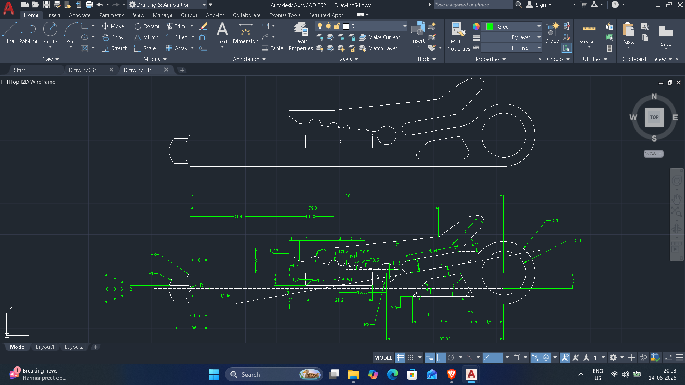
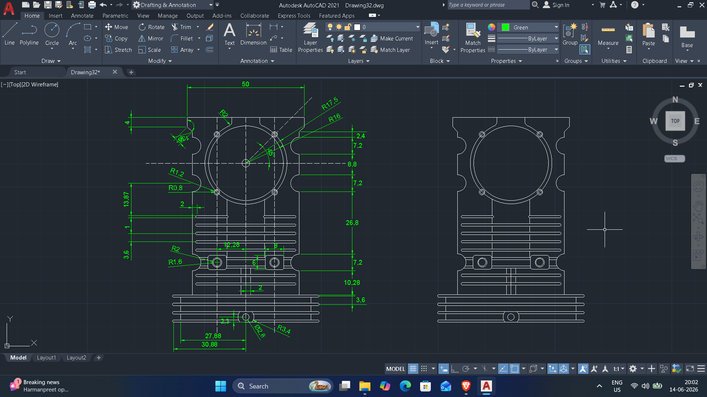
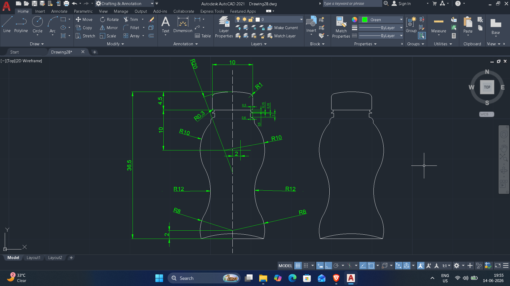
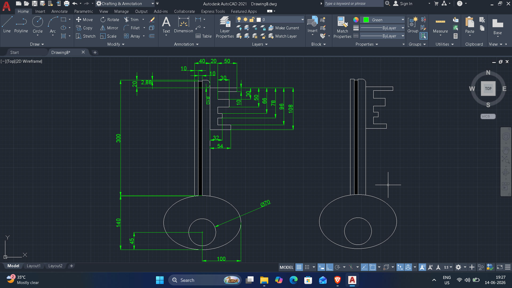
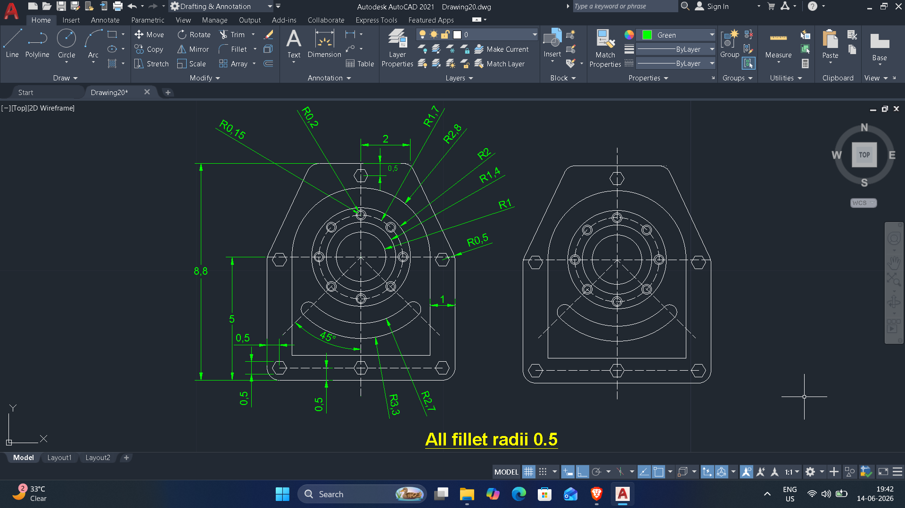
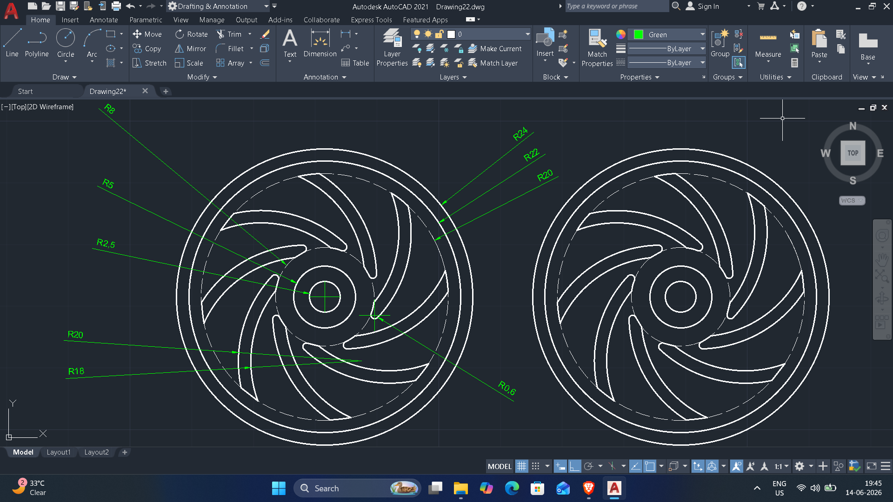
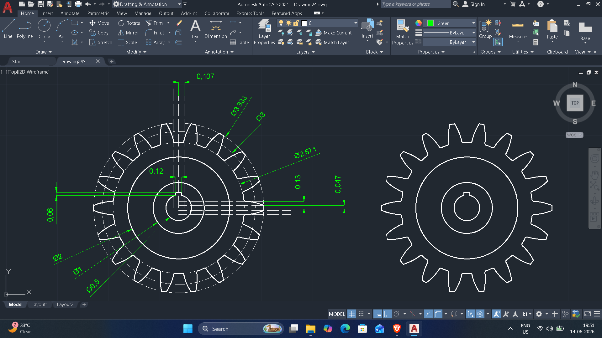
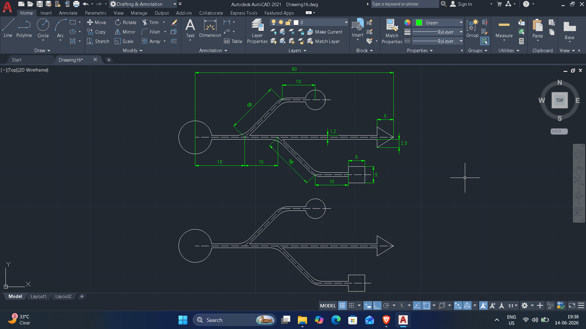
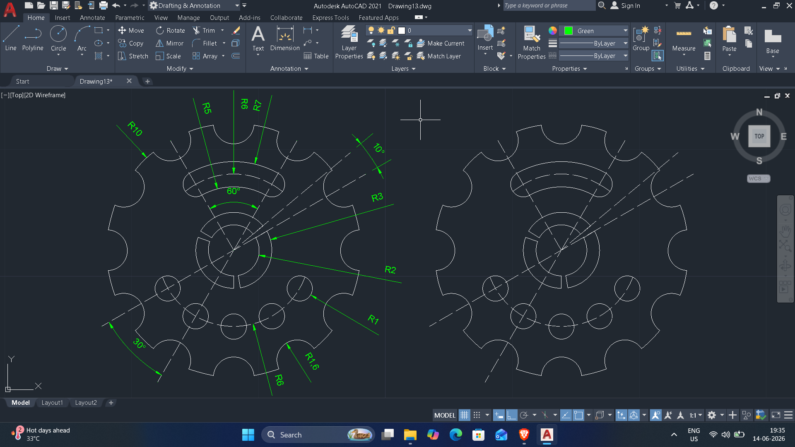
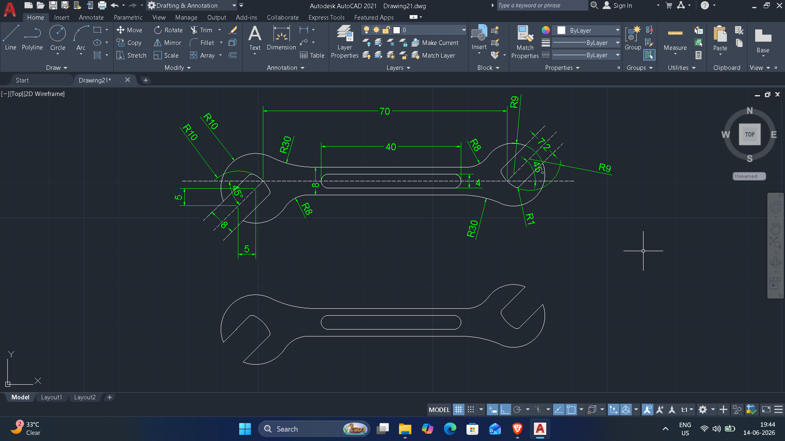

# Autocad-2D-files-cadbook-2
# These are few examples
# Drawing 34

DWG file: Drawing34.dwg

# Drawing 32

DWG file: Drawing32.dwg

# Drawing 28

DWG file: Drawing28.dwg

# Drawing 8

DWG file: Drawing8.dwg

# Drawing 20

DWG file: Drawing20.dwg

# Drawing 22

DWG file: Drawing22.dwg

# Drawing 24

DWG file: Drawing24.dwg

# Drawing 16

DWG file: Drawing16.dwg

# Drawing 13

DWG file: Drawing13.dwg

# Drawing 21

DWG file: Drawing21.dwg
